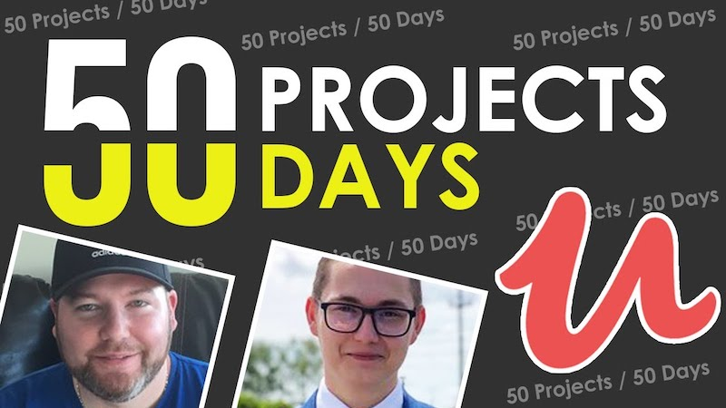

# 50 Days 50 Projects

50 Days 50 Projects is a course on udemy where you can sharpen your skills and build 50 small projects with
Brad Traversy and Florin Pop

https://www.udemy.com/course/50-projects-50-days/

https://50projects50days.com/

| Project                      | Original solution                                                                                                              | Extended solution                                                                                                             |
| ---------------------------- | ------------------------------------------------------------------------------------------------------------------------------ | ----------------------------------------------------------------------------------------------------------------------------- |
| Day 1 - Expanding cards      | [Expanding cards](https://nifty-bassi-f7e468.netlify.app/50%20projects%2050%20days/day%201%20-%20exanding%20cards/)            | [Extended version](https://nifty-bassi-f7e468.netlify.app/50%20projects%2050%20days/day%201%20-%20exanding%20cards/extended/) |
| Day 2 - Progress Steps       | [Progress Steps](https://nifty-bassi-f7e468.netlify.app/50%20projects%2050%20days/day%202%20-%20progress%20steps/)             |
| Day 3 - Progress Steps       | [Rotating navigation](https://nifty-bassi-f7e468.netlify.app/50%20projects%2050%20days/day%202%20-%20rotating%20navigation/)   |
| Day 4 - Hidden search widget | [Hidden search widget](https://nifty-bassi-f7e468.netlify.app/50%20projects%2050%20days/day%202%20-%hidden%20search%20widget/) |
| Day 5 - Blurry loading       | [Blurry loading](https://nifty-bassi-f7e468.netlify.app/50%20projects%2050%20days/day%202%20-%blurry%20loading/)               |
| Day 6 - Scroll animation     | [Scroll animation](https://nifty-bassi-f7e468.netlify.app/50%20projects%2050%20days/day%202%20-%scroll%20animation/)           |
